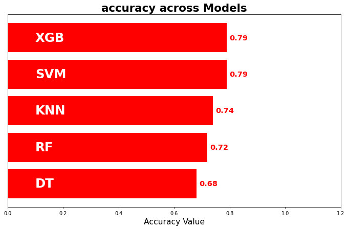
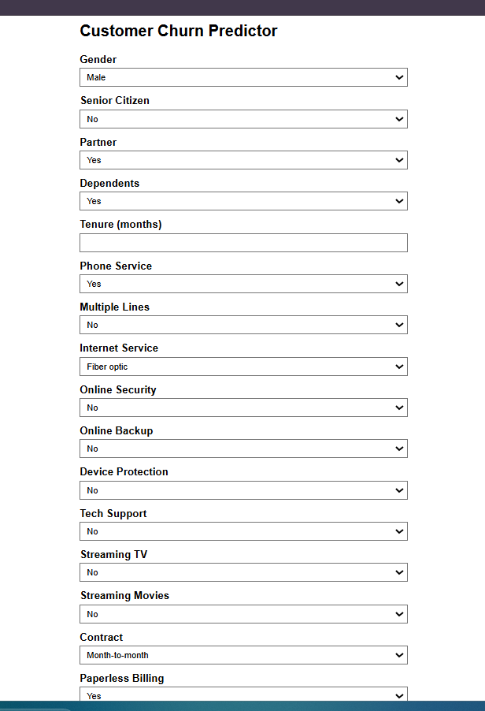
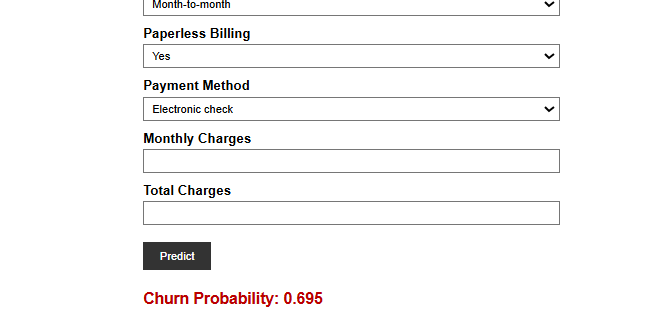

# Customer Churn Prediction API

A deployed, end-to-end machine learning system that predicts the probability a telecom customer will churn — built to compare multiple models honestly (not just report accuracy), served through a FastAPI backend, and containerized for production deployment.

**Live demo:** https://telcochurn-fg6e.onrender.com/
**Note:** hosted on Render's free tier, which spins down after ~15 minutes of inactivity. The first request after idle time may take 30–50 seconds to wake up.

---

## Problem Statement

Customer churn — a customer canceling their service — is one of the most expensive problems in subscription businesses. Acquiring a new customer typically costs far more than retaining an existing one, so identifying *which* customers are likely to churn, before they do, lets a business intervene early (retention offers, targeted support, proactive outreach) instead of reacting after the fact.

This project builds a model that takes a customer's account and usage details and returns a churn probability, wrapped in a usable API and web form rather than left as a notebook.

---

## Dataset

[Telco Customer Churn](https://www.kaggle.com/datasets/blastchar/telco-customer-churn) (Kaggle) — ~7,000 telecom customer records with account details (tenure, contract type, payment method), service subscriptions (internet, streaming, tech support), billing information (monthly/total charges), and the churn label.

The dataset is imbalanced — most customers in the data did **not** churn — which shaped every modeling decision below.

---

## Approach

### 1. Preprocessing
- Categorical features one-hot encoded
- Continuous features (`tenure`, `MonthlyCharges`, `TotalCharges`) transformed with **Box-Cox** to reduce skew, with the lambda fitted on the training set only and reused (not refit) on the test set — avoiding data leakage
- **SMOTE** applied to the training set only, after the train/test split, to address class imbalance without contaminating the test set with synthetic samples

### 2. Model comparison

Five classifiers were trained and evaluated on the same held-out test set. Accuracy alone is misleading on an imbalanced dataset — a model can score well by mostly predicting "no churn" — so the real comparison is on **precision, recall, and F1-score for the churn class specifically**:

| Model | Precision (churn) | Recall (churn) | F1 (churn) | Accuracy |
|-------|-------------------|-----------------|------------|----------|
| KNN   | 0.51 | 0.61 | 0.56 | 0.74 |
| SVM   | 0.63 | 0.51 | 0.56 | 0.79 |
| DT    | 0.44 | 0.81 | 0.57 | 0.68 |
| RF    | 0.49 | 0.75 | 0.59 | 0.72 |
| **XGBoost** | **0.60** | **0.58** | **0.59** | **0.79** |

**XGBoost was selected** as the production model. It tied Random Forest on F1-score but with meaningfully higher precision and accuracy, making it the more reliable choice for production use without over-flagging customers as false positives. (Random Forest remains a reasonable alternative if the business explicitly prioritizes catching every possible churner over precision — that's a threshold/business tradeoff, not a modeling one.)



### 3. Serving
The trained pipeline (StandardScaler + XGBoost), fitted Box-Cox lambdas, and the exact training feature-column layout are all serialized and loaded at API startup, so a new customer record is transformed identically to how the training data was.

---

## Tech Stack

- **Modeling:** scikit-learn, XGBoost, imbalanced-learn (SMOTE), SciPy (Box-Cox)
- **API:** FastAPI, Pydantic (request validation), Jinja2 (server-rendered web form)
- **Serving/Ops:** Docker, Uvicorn
- **Deployment:** Render (Docker web service)

---

## Project Structure

```
.
├── app.py                    # FastAPI app: /predict (JSON API) and web form
├── templates/
│   └── form.html              # Web UI for manual predictions
├── churn_model_notebook.ipynb # Full EDA, preprocessing, model comparison
├── xgb_model.pkl               # Trained XGBoost pipeline (scaler + model)
├── boxcox_lambdas.pkl          # Fitted Box-Cox lambda per continuous feature
├── feature_columns.pkl         # Training-time one-hot column layout
├── requirements.txt
├── Dockerfile
└── README.md
```

---

## Running Locally

```bash
git clone https://github.com/prynshg/TelcoChurn.git
cd TelcoChurn
pip install -r requirements.txt
uvicorn app:app --reload
```

Then open:
- `http://127.0.0.1:8000/` — web form
- `http://127.0.0.1:8000/docs` — interactive API docs (Swagger)



### API usage

```bash
curl -X POST http://127.0.0.1:8000/predict \
  -H "Content-Type: application/json" \
  -d '{
    "gender": "Female", "SeniorCitizen": 0, "Partner": "Yes", "Dependents": "No",
    "tenure": 12, "PhoneService": "Yes", "MultipleLines": "No",
    "InternetService": "Fiber optic", "OnlineSecurity": "No", "OnlineBackup": "Yes",
    "DeviceProtection": "No", "TechSupport": "No", "StreamingTV": "Yes",
    "StreamingMovies": "No", "Contract": "Month-to-month", "PaperlessBilling": "Yes",
    "PaymentMethod": "Electronic check", "MonthlyCharges": 70.35, "TotalCharges": 845.5
  }'
```

Response:
```json
{ "churn_probability": 0.8508432507514954 }
```



---

## Deployment

Containerized with Docker and deployed on Render as a web service, built directly from this repository on every push to `main`.

---

## Limitations & Honest Notes

- The test set is relatively small, so precision/recall/F1 figures carry some variance — they represent one train/test split, not a fully cross-validated estimate.
- The model is trained on a single historical snapshot of customer behavior; real-world deployment would need periodic retraining as customer behavior and offerings change.
- Render's free tier introduces cold-start latency after idle periods — acceptable for a portfolio project, not for production traffic.

## Possible Extensions

- Cross-validated metrics instead of a single split
- SHAP-based feature importance to explain individual predictions
- A monitoring/logging layer to track prediction drift over time

---

## Author

Priyansh Garg — [LinkedIn](https://linkedin.com/in/prynshg) · [GitHub](https://github.com/prynshg)
